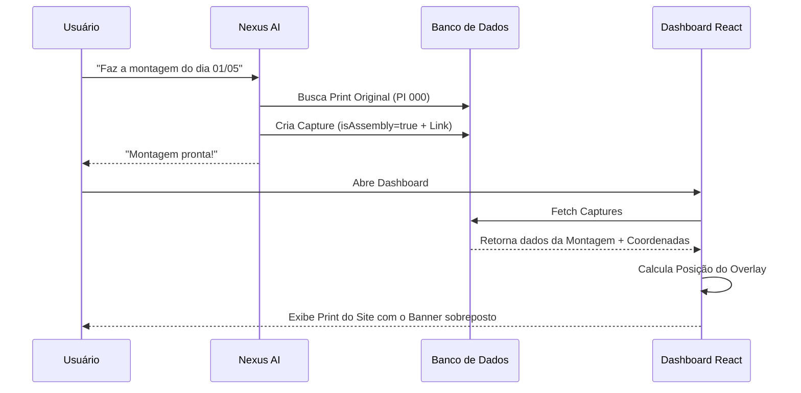

# Arquitetura do Sistema de Montagem (Visual Assembly)

Este documento descreve o fluxo técnico de funcionamento das montagens no Adsnap Cloud, desde a intenção do usuário até a renderização visual no Dashboard.

## 1. Fluxo de Intenção (AI Understanding)

Quando você pede ao Nexus AI para "fazer uma montagem", o processo segue estas etapas:

1.  **Reconhecimento de Comando:** O Nexus identifica a intenção do tipo `MONTAGEM`.
2.  **Extração de Parâmetros:** A inteligência busca no seu pedido:
    *   **Data Alvo:** O dia em que a montagem deve aparecer (ex: 01/05/2026).
    *   **Criativo:** A imagem que você enviou ou mencionou.
    *   **Formato:** O tipo de banner (Superbanner, Billboard, etc).

## 2. Lógica de Negócio (`aiActions.ts`)

A função `MONTAGEM` no motor do Nexus executa as seguintes operações no backend:

- **Busca da Base (PI 000):** O sistema procura por um print real do site (sem anúncios ou com anúncios genéricos) capturado na data solicitada para o mesmo formato. Esse print servirá como "fundo".
- **Vínculo de Campanha:** Identifica a campanha correta para o criativo que você enviou.
- **Criação do Registro:** Cria um novo registro na tabela `Capture` com:
  - `isAssembly: true`: Marcador que indica que este item não é um print único, mas uma composição.
  - `baseCaptureId`: ID do print de fundo (o print 16:9 do site).
  - `screenshotPath`: Caminho do criativo que você enviou.

## 3. Engine de Renderização Front-end

A mágica visual acontece no navegador, através de componentes React especializados (`DashboardView`, `CaptureTimelineCard`, `CaptureSpotlight`).

### A Coordenada de Composição (`compositionBox`)
Cada formato de banner tem metadados de coordenadas (x, y, largura, altura) baseados em uma tela 1920x1080.
Exemplo (Superbanner): `{"x": 596, "y": 250, "width": 728, "height": 90}`.

### Camadas Visuais (Layering)
O sistema renderiza duas camadas em uma mesma "caixa":
1.  **Camada Inferior (Background):** Exibe o print do site (`baseCaptureId`) usando `aspect-video` e `object-contain`.
2.  **Camada Superior (Overlay):** Coloca o seu criativo por cima, usando os percentuais calculados das coordenadas:
    - `left: (x / 1920) * 100%`
    - `top: (y / 1080) * 100%`

## 4. Proxy de Imagens (`/api/captures/[id]`)

Para evitar erros de "imagem corrompida" (CORS ou redirecionamentos do Supabase), todas as imagens passam por um proxy interno. Isso garante que:
- O navegador sempre tenha acesso direto à imagem.
- A composição carregue instantaneamente sem bloqueios de segurança.

## Diagrama de Fluxo

---
> [!NOTE]
> Este sistema permite gerar evidências visuais perfeitas mesmo quando o print original falhou ou quando você precisa testar um novo criativo em um ambiente real.
